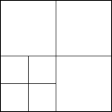
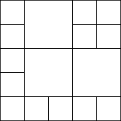

# Task description

You have M square tiles of size 1×1 and N square tiles of size 2×2. Your task is to create the largest possible square using these tiles. Tiles may not overlap, and the resulting square should be filled (it should not contain empty spaces).

Write a function:
```
int solution(int M, int N);
```

that, given two integers M and N, returns the length of the side of the largest square you can create. If no square can be created, your function should return 0.

## Examples:

1. Given M = 8 and N = 0, your function should return 2. You can use four out of eight tiles to arrange them into 2×2 square. There are not enough tiles to create 3×3 square.

2. Given M = 4 and N = 3, your function should return 4. You can obtain a 4×4 square by arranging four 1×1 tiles into a 2×2 square, and surrounding it by 2×2 tiles.

    

3. Given M = 0 and N = 18, your function should return 8. You need to use sixteen 2×2 tiles to create the square. Note that not all the tiles are used.

4. Given M = 13 and N = 3, your function should return 5. One of the possible arrangements is shown in the following image.

    

Write an efficient algorithm for the following assumptions:
• M and N are integers within the range [0..1,000,000,000].