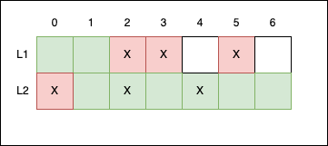

# Task Description

You are given a description of a two-lane road in which two strings, L1 and L2, respectively represent the first and the second lane, each string consisting of segments of equal length.

The K-th segment of the first lane is represented by L1[K] and the K-th segment of the second lane is represented by L2[K], where '.' denotes a smooth segment of road and 'X' denotes a segment containing potholes.

Cars can drive over segments with potholes, But it is rather uncomfortable. Therefore, a project to repair as many potholes as possible was submitted. **At most one contiguous stretch of each lane may be repaired at a time**. For the time of reparation those stretches will be closed to traffic.

How many road segments with potholes can be repaired given that the road must be kept open (in other words, stretches of roadworks must not prevent travel from one end of the road to the other)?

Write a function:

```
int solution(String L1, String L2);
```

that, given two strings L1 and L2 of length N, returns the maximum number of segments with potholes that can be repaired.

## Examples:

### 1. Given L1 = "..XX.X." and L2 = "X.X.X..", your function should return 4 (L2[0], L1[2], L1[3], L1[5]).
It is possible to repair three potholes in the first lane and one first pothole in the second lane without closing the road to traffic.



### 2. Given L1 = ".XXX...X" and L2 = "..X.XXXX", your function should return 6 (L1[1], L1[2], L2[4], L2[5], L2[6], L2[7])

### 3. Given L1 = "XXXXX" and L2 = ".X..X", your function should return 5 (L1[0, 5]).

### 4. Given L1 = "X...X" and L2 = "..X..", your function should return 2 (L1[0], L2[2]).

Write an efficient algorithm for the following assumptions:
- N is an integer within the range [1..200,000]
- strings L1 and L2 consist only of the characters '.' and/or 'X'